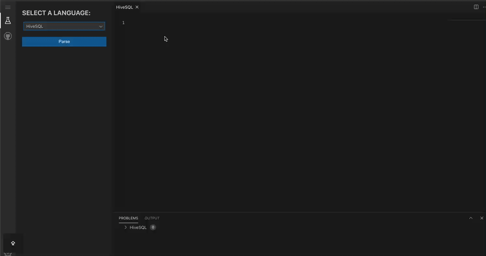

# Monaco SQL Languages

[![NPM version][npm-image]][npm-url] [![NPM downloads][download-img]][download-url]

[npm-image]: https://img.shields.io/npm/v/monaco-sql-languages.svg?style=flat-square
[npm-url]: https://www.npmjs.com/package/monaco-sql-languages
[download-img]: https://img.shields.io/npm/dm/monaco-sql-languages.svg?style=flat
[download-url]: https://www.npmjs.com/package/monaco-sql-languages

[English](./README.md) | 简体中文

Monaco SQL Languages 是一个基于 Monaco Editor 的 SQL 语言项目，从 [monaco-languages](https://github.com/microsoft/monaco-languages) fork 而来。不同的是，Monaco SQL Languages 支持了各种大数据领域的 SQL 语言以及相应的高级语言功能。

<br/>

## 功能亮点
- 代码高亮
- 语法校验
- 自动补全
- 内置SQL代码片段

> 由 [dt-sql-parser](https://github.com/DTStack/dt-sql-parser) 提供语法解析功能。

<br/>

## 在线预览
<https://dtstack.github.io/monaco-sql-languages/>

> 由 [molecule](https://github.com/DTStack/molecule) 提供 IDE UI 支持。

<br/>

## 已支持的 SQL 语言类型

-   MySQL
-   Flink
-   Spark
-   Hive
-   Trino (Presto)
-   PostgreSQL
-   Impala

<br/>

## 安装

```bash
npm install monaco-sql-languages
```

> Tips: 目前 Monaco SQL Languages 仅保证在 `monaco-editor@0.52.2` 上稳定运行。

<br/>

## 集成

- [集成 Monaco SQL Languages 的 ESM 版本](./documents/integrate-esm.zh-CN.md)

<br/>

## 使用

1. **导入语言的 contribution 文件**

    > Tips: 如果通过 MonacoEditorWebpackPlugin 来集成，插件会帮助我们自动引入相应的 contribution 文件。如果使用其他方式集成，则需要手动引入相应的 contribution 文件。

    ```typescript
    import 'monaco-sql-languages/esm/languages/mysql/mysql.contribution';
    import 'monaco-sql-languages/esm/languages/flink/flink.contribution';
    import 'monaco-sql-languages/esm/languages/spark/spark.contribution';
    import 'monaco-sql-languages/esm/languages/hive/hive.contribution';
    import 'monaco-sql-languages/esm/languages/trino/trino.contribution';
    import 'monaco-sql-languages/esm/languages/pgsql/pgsql.contribution';
    import 'monaco-sql-languages/esm/languages/impala/impala.contribution';

    // 或者你可以通过下面的方式一次性导入所有的语言功能
    // import 'monaco-sql-languages/esm/all.contributions';
    ```

2. **设置语言功能**

    你可以通过 `setupLanguageFeatures` 设置语言功能，比如设置 FlinkSQL 语言的自动补全功能。
    ```typescript
    import { LanguageIdEnum, setupLanguageFeatures } from 'monaco-sql-languages';

    setupLanguageFeatures(LanguageIdEnum.FLINK, {
        completionItems: {
            enable: true,
            triggerCharacters: [' ', '.'],
            completionService: //... ,
        }
    });
    ```

    默认情况下，自动补全功能只提供关键字自动补全与内置SQL代码片段补全, 但你可以通过设置 `completionService` 自定义自动补全项。

    ```typescript
    import { languages } from 'monaco-editor/esm/vs/editor/editor.api';
    import {
        setupLanguageFeatures,
        LanguageIdEnum,
        CompletionService,
        ICompletionItem,
        EntityContextType
     } from 'monaco-sql-languages';

    const completionService: CompletionService = function (
        model,
        position,
        completionContext,
        suggestions, // 语法推荐信息
        entities, // 当前编辑器文本的语法上下文中出现的表名、字段名等
        snippets // 代码片段
    ) {
        return new Promise((resolve, reject) => {
            if (!suggestions) {
                return Promise.resolve([]);
            }
            const { keywords, syntax } = suggestions;
            const keywordsCompletionItems: ICompletionItem[] = keywords.map((kw) => ({
                label: kw,
                kind: languages.CompletionItemKind.Keyword,
                detail: 'keyword',
                sortText: '2' + kw
            }));

            let syntaxCompletionItems: ICompletionItem[] = [];

            syntax.forEach((item) => {
                if (item.syntaxContextType === EntityContextType.DATABASE) {
                    const databaseCompletions: ICompletionItem[] = []; // some completions about databaseName
                    syntaxCompletionItems = [...syntaxCompletionItems, ...databaseCompletions];
                }
                if (item.syntaxContextType === EntityContextType.TABLE) {
                    const tableCompletions: ICompletionItem[] = []; // some completions about tableName
                    syntaxCompletionItems = [...syntaxCompletionItems, ...tableCompletions];
                }
            });

            resolve([...syntaxCompletionItems, ...keywordsCompletionItems]);
        });
    };

    setupLanguageFeatures(LanguageIdEnum.FLINK, {
        completionItems: {
            enable: true,
            completionService,
        }
    });
    ```

3. **创建 Monaco Editor 并指定语言**

    ```typescript
    import { LanguageIdEnum } from 'monaco-sql-languages';

    monaco.editor.create(document.getElementById('container'), {
        value: 'select * from tb_test',
        language: LanguageIdEnum.FLINK // languageId
    });
    ```

<br/>

## 代码片段
我们为每种SQL语言内置了一部分代码片段, 帮助我们快速编写SQL。

**如何自定义代码片段?**

在进行设置语言功能时, 通过配置`snippets`实现, 当`snippets`传入空数组时, 则关闭内置代码片段。

```typescript
import { snippets, CompletionSnippetOption } from 'monaco-sql-languages/esm/main.js';

const customSnippets: CompletionSnippetOption[] = [
    {
        label: 'INSERT',
        prefix: 'insert',
        // Will join the line with `\n`
        body: [
            'INSERT INTO ${1:table_name}',
            'SELECT ${3:column1}, ${4:column2}',
            'FROM ${2:source_table}',
            'WHERE ${5:conditions};\n$6'
        ],
        description: "This is an 'insert into select' snippet"
    }
];

setupLanguageFeatures(LanguageIdEnum.MYSQL, {
    completionItems: {
        enable: true,
        snippets: [...snippets.mysqlSnippets, ...customSnippets],
        completionService
    },
    preprocessCode
});
```
代码片段详细语法可以参考[vscode-snippet](https://code.visualstudio.com/docs/editor/userdefinedsnippets#_snippet-syntax), 不过与 vscode 代码片段不同的是, 我们仅会在**SQL语句开头**提供 snippets 补全项。

还需要注意的是，如果您提供了自定义的`completionService`方法, 您需要将`snippets`作为补全项手动返回, 以下是一个简单示例:

```typescript
const completionService: CompletionService = async function (
    model,
    position,
    completionContext,
    suggestions,
    entities,
    snippets
) {
    const { keywords } = suggestions;

    const keywordsCompletionItems: ICompletionItem[] = keywords.map((kw) => ({
        label: kw,
        kind: languages.CompletionItemKind.Keyword,
        detail: 'keyword',
        sortText: '2' + kw
    }));

    const snippetCompletionItems: ICompletionItem[] =
        snippets?.map((item) => ({
            label: item.label || item.prefix,
            kind: languages.CompletionItemKind.Snippet,
            filterText: item.prefix,
            insertText: item.insertText,
            insertTextRules: languages.CompletionItemInsertTextRule.InsertAsSnippet,
            sortText: '3' + item.prefix,
            detail: item.description !== undefined ? item.description : 'SQL Snippet',
            documentation: item.insertText
        })) || [];

    return [...keywordsCompletionItems, ...snippetCompletionItems];
};
```

**其他注意事项**

当处于代码片段中时, 可以通过`Tab`键移动到下一个输入位置, 但普通的关键字补全功能也是通过`Tab`键接受补全的，这会产生快捷键冲突, 所以 Monaco-Editor 规定, 当处于代码片段上下文时, 不会触发补全功能。

如果想要在代码片段中仍能支持智能补全, 可以通过设置 Monaco-Editor 配置项`suggest.snippetsPreventQuickSuggestions`为`false`来实现。
```typescript
editor.create(editorElement, {
    suggest: {
        snippetsPreventQuickSuggestions: false
    }
})
```


## Monaco Theme

> Monaco SQL Languages 计划在未来支持更多的 Monaco Theme.

Monaco SQL Languages 提供了名为 `vsPlusTheme` 的内置主题。 `vsPlusTheme` 灵感来源于 vscode default plus 颜色主题，内部包含三种风格的主题:

-   `darkTheme`: 暗黑色主题，继承自 Monaco 内置主题 `vs-dark`;
-   `lightTheme`: 亮色主题， 继承自 Monaco 内置主题 `vs`;
-   `hcBlackTheme`: 黑色高对比度主题，继承自 Monaco 内置主题 `hc-black`;

**使用 Monaco SQL Languages 内置主题 vsPlusTheme**

```typescript
import { vsPlusTheme } from 'monaco-sql-languages';
import { editor } from 'monaco-editor';

// 导入主题数据并定义主题, 你可以自定义主题名称, 例如 sql-dark
editor.defineTheme('sql-dark', vsPlusTheme.darkThemeData);
editor.defineTheme('sql-light', vsPlusTheme.lightThemeData);
editor.defineTheme('sql-hc', vsPlusTheme.hcBlackThemeData);

// 指定你已定义的主题
editor.create(null as any, {
    theme: 'sql-dark',
    language: 'flinksql'
});
```

**自定义主题**

```typescript
import { TokenClassConsts, postfixTokenClass } from 'monaco-sql-languages';

// 自定义不同 token 类型的样式
const myThemeData: editor.IStandaloneThemeData = {
    base: 'vs-dark',
    inherit: true,
    rules: [
        { token: postfixTokenClass(TokenClassConsts.COMMENT), foreground: '6a9955' },
        { token: postfixTokenClass(TokenClassConsts.IDENTIFIER), foreground: '9cdcfe' },
        { token: postfixTokenClass(TokenClassConsts.KEYWORD), foreground: '569cd6' },
        { token: postfixTokenClass(TokenClassConsts.NUMBER), foreground: 'b5cea8' },
        { token: postfixTokenClass(TokenClassConsts.STRING), foreground: 'ce9178' },
        { token: postfixTokenClass(TokenClassConsts.TYPE), foreground: '4ec9b0' }
    ],
    colors: {}
};

// 定义 Monaco 主题
editor.defineTheme('my-theme', myThemeData);
```

> `postfixTokenClass` 在大多数情况下不是必须的，但是由于 Monaco SQL Languages 内部为所有的语言都设置了 `tokenPostfix: 'sql'`。所以在某些情况下，如果不使用 `postfixTokenClass` 处理 `TokenClassConsts.*`，自定义的样式可能不生效。

<br/>

## 开发者：本地开发

-   初始化设置

    ```bash
    pnpm install
    ```

-   本地启动 web demo

    ```bash
    pnpm watch-esm
    cd website
    pnpm install
    pnpm dev
    ```

-   构建

    ```bash
    pnpm build
    ```

-   单元测试
    ```
    pnpm test
    ```

<br/>

## 行为守则

本项目采用 [Microsoft 开源行为准则](https://opensource.microsoft.com/codeofconduct/)。有关更多信息，请参阅 [Code of Conduct FAQ](https://opensource.microsoft.com/codeofconduct/faq/)，或联系 [opencode@microsoft.com](mailto:opencode@microsoft.com) 提出任何其他问题或意见。

<br/>

## License

[MIT](https://github.com/Microsoft/monaco-languages/blob/master/LICENSE.md)
