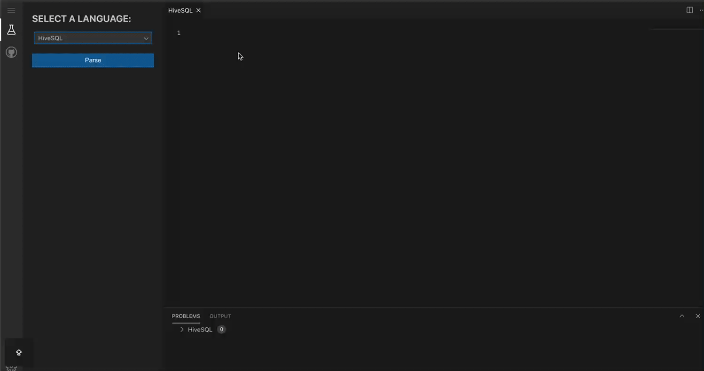
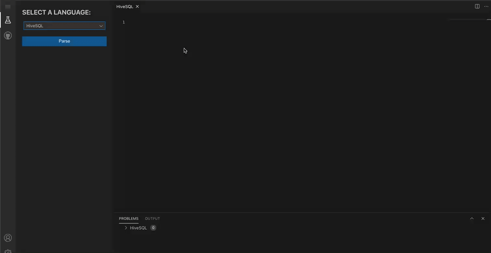

# Monaco SQL Languages

[![NPM version][npm-image]][npm-url] [![NPM downloads][download-img]][download-url]

[npm-image]: https://img.shields.io/npm/v/monaco-sql-languages.svg?style=flat-square
[npm-url]: https://www.npmjs.com/package/monaco-sql-languages
[download-img]: https://img.shields.io/npm/dm/monaco-sql-languages.svg?style=flat
[download-url]: https://www.npmjs.com/package/monaco-sql-languages

English | [简体中文](./README-zh_CN.md)

This project is based on the SQL language project of Monaco Editor, which was forked from the [monaco-languages](https://github.com/microsoft/monaco-languages).The difference is that Monaco SQL Languages supports various SQL languages and the corresponding advanced features for the **Big Data field**.

<br/>

## Feature highlights
- Code Highlighting
- Syntax Validation
- Code Completion
- Built-in SQL Snippets

> Powered By [dt-sql-parser](https://github.com/DTStack/dt-sql-parser)

<br/>

## Online Preview
<https://dtstack.github.io/monaco-sql-languages/>

> Powered By [molecule](https://github.com/DTStack/molecule).

<br/>

## Supported SQL Languages

-   MySQL
-   Flink
-   Spark
-   Hive
-   Trino (Presto)
-   PostgreSQL
-   Impala

<br/>

## Installing

```bash
npm install monaco-sql-languages
```

> Tips: Monaco SQL Languages is only guaranteed to work stably on `monaco-editor@0.52.2` for now.

<br/>

## Integrating

-  [Integrating the ESM version of Monaco SQL Languages](./documents/integrate-esm.md)

<br/>

## Usage

1. **Import language contributions**
    > Tips: If integrated via MonacoEditorWebpackPlugin, it will help us to import contribution files automatically. Otherwise, you need to import the contribution files manually.

    ```typescript
    import 'monaco-sql-languages/esm/languages/mysql/mysql.contribution';
    import 'monaco-sql-languages/esm/languages/flink/flink.contribution';
    import 'monaco-sql-languages/esm/languages/spark/spark.contribution';
    import 'monaco-sql-languages/esm/languages/hive/hive.contribution';
    import 'monaco-sql-languages/esm/languages/trino/trino.contribution';
    import 'monaco-sql-languages/esm/languages/pgsql/pgsql.contribution';
    import 'monaco-sql-languages/esm/languages/impala/impala.contribution';

    // Or you can import all language contributions at once.
    // import 'monaco-sql-languages/esm/all.contributions';
    ```

2. **Setup language features**

    You can setup language features via `setupLanguageFeatures`. For example, setup code completion feature of flinkSQL language.

    ```typescript
    import { LanguageIdEnum, setupLanguageFeatures } from 'monaco-sql-languages';

    setupLanguageFeatures(LanguageIdEnum.FLINK, {
        completionItems: {
            enable: true,
            triggerCharacters: [' ', '.'],
            completionService: //... ,
        }
    });
    ```

    By default, Monaco SQL Languages only provides keyword autocompletion and built-in SQL snippets, and you can customize your completionItem list via `completionService`.

    ```typescript
    import { languages } from 'monaco-editor/esm/vs/editor/editor.api';
    import {
        setupLanguageFeatures,
        LanguageIdEnum,
        CompletionService,
        ICompletionItem,
        EntityContextType
     } from 'monaco-sql-languages';

    const completionService: CompletionService = function (
        model,
        position,
        completionContext,
        suggestions, // syntax context info at caretPosition
        entities, // tables, columns in the syntax context of the editor text
		snippets // SQL snippets
    ) {
        return new Promise((resolve, reject) => {
            if (!suggestions) {
                return Promise.resolve([]);
            }
            const { keywords, syntax } = suggestions;
            const keywordsCompletionItems: ICompletionItem[] = keywords.map((kw) => ({
                label: kw,
                kind: languages.CompletionItemKind.Keyword,
                detail: 'keyword',
                sortText: '2' + kw
            }));

            let syntaxCompletionItems: ICompletionItem[] = [];

            syntax.forEach((item) => {
                if (item.syntaxContextType === EntityContextType.DATABASE) {
                    const databaseCompletions: ICompletionItem[] = []; // some completions about databaseName
                    syntaxCompletionItems = [...syntaxCompletionItems, ...databaseCompletions];
                }
                if (item.syntaxContextType === EntityContextType.TABLE) {
                    const tableCompletions: ICompletionItem[] = []; // some completions about tableName
                    syntaxCompletionItems = [...syntaxCompletionItems, ...tableCompletions];
                }
            });

            resolve([...syntaxCompletionItems, ...keywordsCompletionItems]);
        });
    };

    setupLanguageFeatures(LanguageIdEnum.FLINK, {
        completionItems: {
            enable: true,
            completionService: //... ,
        }
    });
    ```

3. **Create the Monaco Editor instance and specify the language you need**

    ```typescript
    import { LanguageIdEnum } from 'monaco-sql-languages';

    monaco.editor.create(document.getElementById('container'), {
        value: 'select * from tb_test',
        language: LanguageIdEnum.FLINK // languageId
    });
    ```

<br/>

## SQL Snippets

We provide some built-in SQL snippets for each SQL language, which helps us to write SQL quickly.

**How to customize SQL snippets?**

When setting language features, you can customize SQL snippets via `snippets` configuration. When `snippets` is passed in as an empty array, the built-in SQL snippets are disabled.

```typescript
import { snippets, CompletionSnippetOption } from 'monaco-sql-languages/esm/main.js';

const customSnippets: CompletionSnippetOption[] = [
    {
        label: 'INSERT',
        prefix: 'insert',
        // Will join the line with `\n`
        body: [
            'INSERT INTO ${1:table_name}',
            'SELECT ${3:column1}, ${4:column2}',
            'FROM ${2:source_table}',
            'WHERE ${5:conditions};\n$6'
        ],
        description: "This is an 'insert into select' snippet"
    }
];
```

Snippets syntax can refer to [vscode-snippet](https://code.visualstudio.com/docs/editor/userdefinedsnippets#_snippet-syntax).
But it is different from vscode code snippets, we only provide snippets completions **at the beginning of the SQL statement**.

Note: If you provide a custom `completionService` method, you need to manually return the `snippets` as completions, as shown in the following example:

```typescript
const completionService: CompletionService = async function (
    model,
    position,
    completionContext,
    suggestions,
    entities,
    snippets
) {
    const { keywords } = suggestions;

    const keywordsCompletionItems: ICompletionItem[] = keywords.map((kw) => ({
        label: kw,
        kind: languages.CompletionItemKind.Keyword,
        detail: 'keyword',
        sortText: '2' + kw
    }));

    const snippetCompletionItems: ICompletionItem[] =
        snippets?.map((item) => ({
            label: item.label || item.prefix,
            kind: languages.CompletionItemKind.Snippet,
            filterText: item.prefix,
            insertText: item.insertText,
            insertTextRules: languages.CompletionItemInsertTextRule.InsertAsSnippet,
            sortText: '3' + item.prefix,
            detail: item.description !== undefined ? item.description : 'SQL Snippet',
            documentation: item.insertText
        })) || [];

    return [...keywordsCompletionItems, ...snippetCompletionItems];
};
```

Other Notes:

When in code snippet context, you can use `Tab` key to move to the next input position, but the keywords completions is also triggered by `Tab` key, which will cause a shortcut key conflict. So Monaco-Editor stipulates that when in code snippet context, it will not trigger completion.

If you want to still support intelligent completion in code snippet context, you can set the Monaco-Editor configuration item `suggest.snippetsPreventQuickSuggestions` to `false` to achieve it.
```typescript
editor.create(editorElement, {
    suggest: {
        snippetsPreventQuickSuggestions: false
    }
})
```


## Monaco Theme

> Monaco SQL Languages plan to support more themes in the future.

Monaco SQL Languages provides built-in Monaco Theme that is named `vsPlusTheme`. `vsPlusTheme` inspired by vscode default plus colorTheme and it contains three styles of themes inside:

-   `darkTheme`: Inherited from monaco built-in theme `vs-dark`;
-   `lightTheme`: Inherited from monaco built-in theme `vs`;
-   `hcBlackTheme`: Inherited from monaco built-in theme `hc-black`;

**Use Monaco SQL Languages built-in vsPlusTheme**

```typescript
import { vsPlusTheme } from 'monaco-sql-languages';
import { editor } from 'monaco-editor';

// import themeData and defineTheme, you can customize the theme name, e.g. sql-dark
editor.defineTheme('sql-dark', vsPlusTheme.darkThemeData);
editor.defineTheme('sql-light', vsPlusTheme.lightThemeData);
editor.defineTheme('sql-hc', vsPlusTheme.hcBlackThemeData);

// specify the theme you have defined
editor.create(null as any, {
    theme: 'sql-dark',
    language: 'flinksql'
});
```

**Customize your own Monaco theme**

```typescript
import { TokenClassConsts, postfixTokenClass } from 'monaco-sql-languages';

// Customize the various tokens style
const myThemeData: editor.IStandaloneThemeData = {
    base: 'vs-dark',
    inherit: true,
    rules: [
        { token: postfixTokenClass(TokenClassConsts.COMMENT), foreground: '6a9955' },
        { token: postfixTokenClass(TokenClassConsts.IDENTIFIER), foreground: '9cdcfe' },
        { token: postfixTokenClass(TokenClassConsts.KEYWORD), foreground: '569cd6' },
        { token: postfixTokenClass(TokenClassConsts.NUMBER), foreground: 'b5cea8' },
        { token: postfixTokenClass(TokenClassConsts.STRING), foreground: 'ce9178' },
        { token: postfixTokenClass(TokenClassConsts.TYPE), foreground: '4ec9b0' }
    ],
    colors: {}
};

// Define the monaco theme
editor.defineTheme('my-theme', myThemeData);
```

> `postfixTokenClass` is not required in most cases, but since Monaco SQL Languages has `tokenPostfix: 'sql'` internally set for all SQL languages, in some cases your custom style may not work if you don't use `postfixTokenClassClass` to handle `TokenClassConsts.*`.

<br/>

## Dev: cheat sheet

-   initial setup

    ```bash
    pnpm install
    ```

-   open the dev web

    ```bash
    pnpm watch-esm
    cd website
    pnpm install
    pnpm dev
    ```

-   build

    ```bash
    pnpm build
    ```

-   run test
    ```
    pnpm test
    ```

<br/>

## Code of Conduct

This project has adopted the [Microsoft Open Source Code of Conduct](https://opensource.microsoft.com/codeofconduct/). For more information see the [Code of Conduct FAQ](https://opensource.microsoft.com/codeofconduct/faq/) or contact [opencode@microsoft.com](mailto:opencode@microsoft.com) with any additional questions or comments.

<br/>

## License

[MIT](https://github.com/Microsoft/monaco-languages/blob/master/LICENSE.md)
